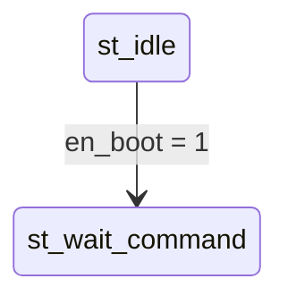

# Oregano8051_HW_bootloader

implementation of a hardware bootloader for the Oregano8051 kernel taking advantage of the TmrCtrl hardware and the SIU interface of the Oregano8051 itself.
____

```mermaid
stateDiagram-v2

    st_idle --> st_wait_command: en_boot = 1

```

____
